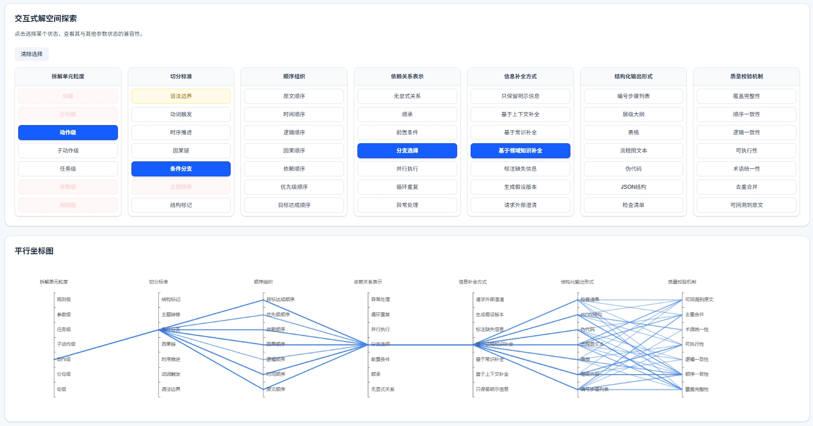

# 🧠 Motifold

**一个 AI 原生的生产力与认知辅助平台。**

Motifold 将结构化问题求解（形态分析）与可视化知识拆解（黑板推演）整合到统一的工作区中，帮助你在面对复杂任务与决策时拥有更强大的思考能力。

## 🎯 核心功能

### 💬 智能对话
与 AI 助手进行自然对话，支持异步处理和实时流式响应。系统会根据任务复杂度自动选择合适的模型。

### 📊 形态分析矩阵

<div align="center">
  
</div>

基于"茨威基形态学分析法"的复杂问题分析工具。将多维问题拆解为 7×7 的参数矩阵，评估各组合的兼容性，帮你找到所有可能的解空间，避免认知盲区。

**功能流程：**

1. **输入焦点问题** — 描述你想要解决的复杂问题或设计决策
2. **AI 关键词提取** — 从问题描述中自动识别关键概念
3. **生成参数与状态** — AI 严格遵循"7×7 法则"，生成 7 个正交参数（维度），每个参数包含 7 个独立状态
4. **交叉一致性评估** — AI 对所有参数对的组合进行成对评估：
   - 🟢 **绿色** — 完全兼容，逻辑上可行
   - 🟡 **黄色** — 有条件兼容，在特定条件下可行
   - 🔴 **红色** — 互斥，逻辑矛盾或工程上不可行
5. **可视化探索** — 通过平行坐标图直观筛选可行的解空间组合

### 👨‍🏫 黑板推演
将复杂知识空间化呈现的认知工具。AI 扮演教师角色，将知识拆解为独立的文本、公式、结论区块，按逻辑顺序逐步讲解，带来沉浸式的学习体验。

### 🔌 MCP 协议支持
可被其他 AI 工具和智能体调用，读取工作区内容、获取聊天历史、触发分析任务。支持 SSE 和 stdio 两种连接方式。

## 🚀 快速开始

### 环境要求
- Docker 和 Docker Compose
- OpenAI API Key

### 启动服务

```bash
# 1. 配置环境变量
cp backend/.env.example backend/.env
# 编辑 backend/.env，填入你的 OpenAI API Key

# 2. 启动全栈服务
make up
```

服务启动后：
- 前端应用：http://localhost:13000
- API 服务：http://localhost:18000
- MCP SSE 端点：http://localhost:18000/mcp

### 本地 MCP 调用（可选）

```bash
cd backend
uv run motifold-local-mcp
```

## 💡 使用场景

| 场景 | 推荐功能 |
|------|---------|
| 复杂决策分析 | 形态分析矩阵 |
| 学习新知识 | 黑板推演 |
| 日常问答 | 智能对话 |
| 集成到其他 AI 工具 | MCP 协议 |

## 🔒 数据说明

所有数据存储在本地 PostgreSQL 数据库中，工作区之间完全隔离。

## 🤝 欢迎反馈

有问题或建议？欢迎提交 Issue。
